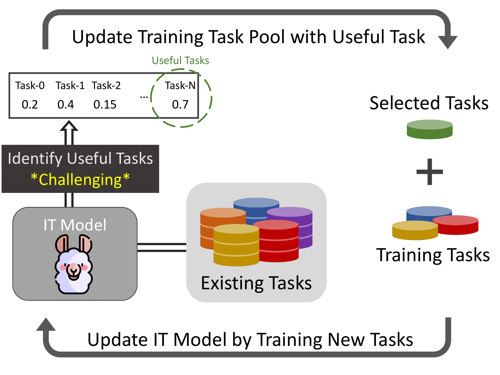
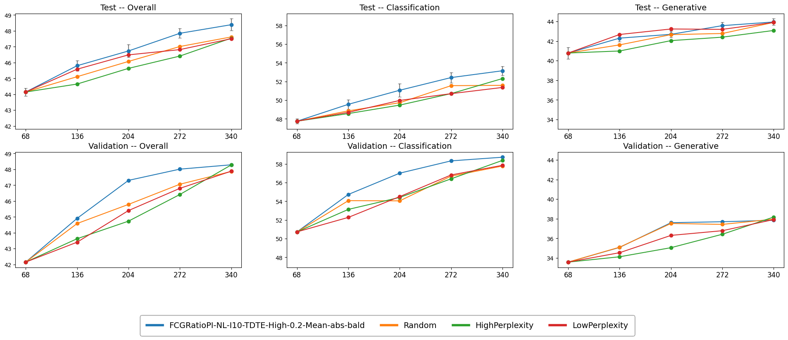
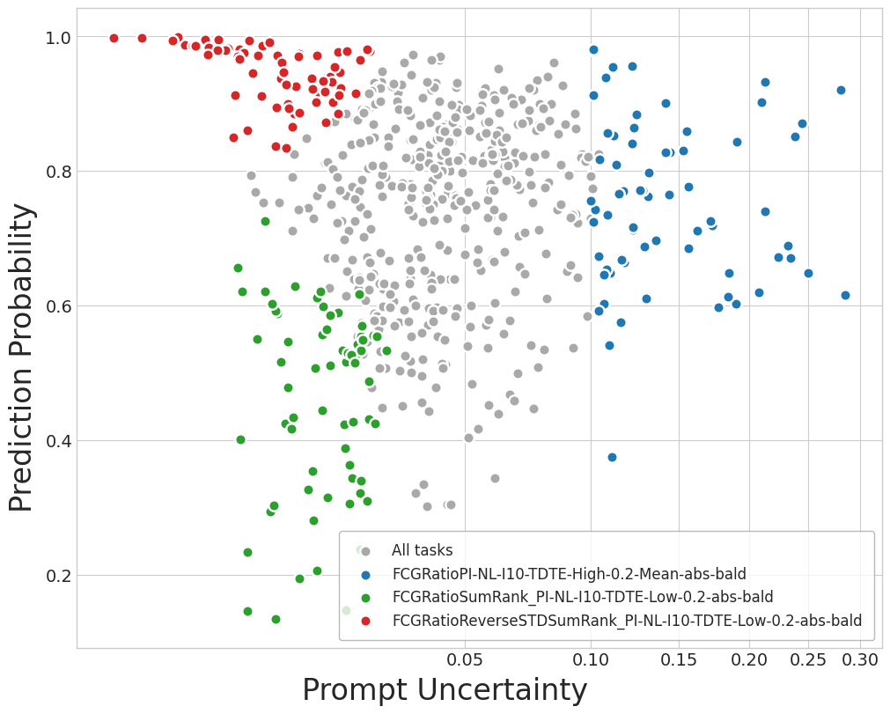

# Active Instruction Tuning
<p align="center">
  
</p>

- This repo releases our implementation for the ActiveIT in the [Active Instruction Tuning paper](https://arxiv.org/abs/2311.00288).
- Active Instruction Tuning aims to select novel tasks from a large task pool, and continuously improve the model's performance by training on this subset of tasks
- In this work, we proposed the following three components:
  * **Active Instruction Tuning**: A framework to actively select novel tasks to improve an instruction-tuned model.
  * **Prompt Uncertainty**: Measure prompt sensitiveness of a task to a model and identify novel 
  * **Task Map**: Task categorization tool to identify Easy, Difficult, and Ambiguous tasks without the need for data labels. 

## About This Repo 
- This code is built upon [TK-Instruct] Repo(https://github.com/yizhongw/Tk-Instruct).
- In this repo, we release our experiment code on [Natural Instructions V2](https://github.com/allenai/natural-instructions) dataset.
- We provide the following code:
  - Reprodice experiment results on [Natural Instructions V2](https://github.com/allenai/natural-instructions) dataset.
  - Active Instruction Tuning pipeline code
    - Prompt Uncertainty
    - Random Sampling
    - High/Low Perplexity
  - Task Map Visualization


## Requirements

Our main experiments and analysis are conducted on the following environment:

- CUDA (11.3)
- cuDNN (8.2.0.53)
- Pytorch (1.10.0)
- Transformers (4.17.0)
- DeepSpeed

```bash
pip install -r requirements.txt
```

## Preparation

Before running experiments, should download natural-instruction-v2 dataset, and then copy the task information from our previous experiments for reproducing. Run the following script to prepare the files.

```bash
sh prepare.sh
```

## Reproduce Experiments Results

To reproduce the experiments results from the paper, we will use the task split we got from our experiments. When running the following experiment script, it will not update the task pool at each ActiveIT iteration but to use the one from our experiments.

```bash
cd ActiveIT
sh reproduce.sh
```

- Note the following:
  - For reproduce purpose, we do not update the task pool but use out previous seleted tasks. This is done by specifying `--no_update_task_list` in `ActiveIT/reproduce.sh`
  - The reason why we've done this is because of the **large variance** during task selection. While we fix the selected tasks to be the same as our previous experiments, the data randomly select from each task is still different, which can make the results different from our report scores.
  - `To get a fair performance comparison, always run the experiment on multiple random seeds and get the average scores.`

- After running the ActiveIT pipleine, you can check your score via `ActiveIT/ActiveIT_README.ipynb` You can also check the TaskMap of the trained model via this file. 
  - However, as we mentioned that we do not update the training task list but use the old one for reproducibility, the selected task plotted in the Task Map is the old one, which can make the selected task looks inconsistent with the task selecting algorithm.
  - For example, while prompt uncertainty method should select the tasks with highest prompt uncertainty(the rightmost points), it will not be the case in the Task Map plotted here. Since the prompt uncertainty and prediction probability of all these tasks are measured from this newly trained model and the selected tasks are based on our previous experiments, the selected tasks plotted here might not all be the rightmost points.

## Running New Experiments

### Create New Task Pool
To run new experiments, you can follow the `ActiveIT/ActiveIT_README.ipynb` to create new random splits(Task Pool), which include a new random set of training tasks for iteration 0. The newly created splits can be found at `natural-instructions/splits/`.

### Run New Experiments
To run a new experiments, you can run the following script in `ActiveIT/` folder:
```
python3 my_scripts/TLAL/TLAL_pipeline.py
  --AL_type FCGRatioPI-NL-I10-TDTE-High-0.2-Mean-abs-bald
  --gpus $GPUS
  --split_dir ../natural-instructions/splits/TLAL_Exp0_all_10
  --max_iter 5
  --fix_cls_gen_ratio 0.356
  --base_script my_scripts/TLAL/TLAL_base_script_v4.sh
  --perturb_num 10
```

- Here we explain what each argument does:
- `--AL_type`: Specify the task selection strategy.
  - `*Random*`: Random Sampling if the string contains the keyword 'Random'.
  - `HighPerplexity`: Select tasks with high perplexity if the string is exactly 'HighPerplexity'.
  - `LowPerplexity`: Select tasks with low perplexity if the string is exactly 'LowPerplexity'.
  - `*PI-NL-I10-TDTE-High-0.2-Mean-abs-bald`: Select tasks based on prompt uncertainty. The AL_type here defines the active IT configuration, so will need to follow a specific pattern:
    - `PI-`: Need to be specified to use prompt uncertainty. Can add arbitrary prefix in the name. In this example, we add FCGRatio, which doesn't affect the pipeline config.
    - `NL`: If specified, it means 'No Labels' that we don't use the label for prompt uncertainty. Can also specify `HL` which means 'Have Labels', which will use the data ground truth as the original prediction during prompt uncertainty measuring.
    - `I10`: Specify the instance number to use for prompt uncertainty measuring. For this example, will sample 10 examples from a task and measure prompt uncertainty, and then average it.
    - `TDTE`: Specify the prompt perturbation target. The choices are `[TD, TE, TDTE]`, which TD means that we perturb the task definition, and TE means that we perturb the provided examples, and TDTE to perturb both.
    - `High`: Specify what to select after the getting the prompt uncertainty. `[High, Low]` means to select task with high/low prompt uncertainty, respectively.
    - `0.2`: Specify the prompt perturbation rate, should be a number between [0,1]. Here we specify 0.2, which will assign a 0.2 dropping probability for each token.
    - `Mean-abs-bald`: Simply need to specify this at the end. This will specify the prompt uncertainty measuring method described in our paper.
  - For all the arguments, please make sure to specify them in the `--AL_Type` following the above format.


## Evaluation

### Getting Pipeline Curve
To get the pipeline results, refer to `ActiveIT/ActiveIT_README.ipynb`.
You should get something like this:
<p align="center">
  
</p>

### Eval Single Model
The following script evaluates the model with `task definition + 2 positive examples` as instructions:

```bash
./scripts/eval_tk_instruct.sh
```

## Task Map Visualization

To visualize task map, refer to `ActiveIT/ActiveIT_README.ipynb`.
You should get something like this:
<p align="center">
  
</p>

The task plotted on this task map with `Prediciton Probability` and `Prompt Uncertainty` measured by the model with first task selection method. In this example, it is measured from `FCGRatioPI-NL-I10-TDTE-High-0.2-Mean-abs-bald`. Note that the uncertainty scores measured from different models(or the same models with different random seed) can be different due to randomness. Also, when plotting task map for multiple ActiveIT iterations(`total_run > 1`), please make sure only specify one uncertainty method, since the task pool can be different after iteration 2 for each task selection method(the task selected at iter 1 can be different).

## Citation

```bib
@article{kung2023active,
  title={Active Instruction Tuning: Improving Cross-Task Generalization by Training on Prompt Sensitive Tasks},
  author={Kung, Po-Nien and Yin, Fan and Wu, Di and Chang, Kai-Wei and Peng, Nanyun},
  journal={arXiv preprint arXiv:2311.00288},
  year={2023}
}
```
